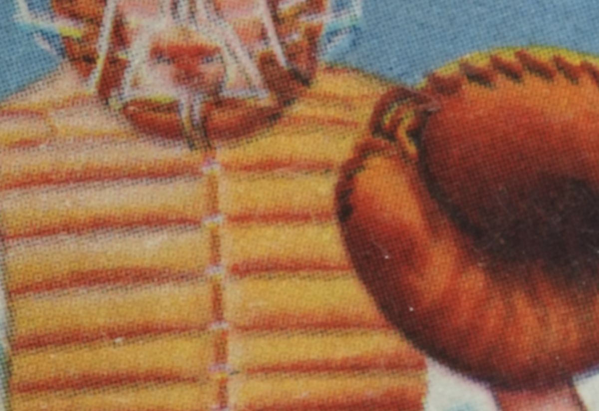
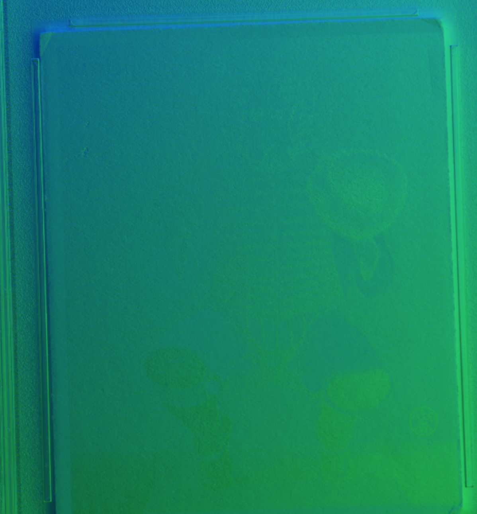
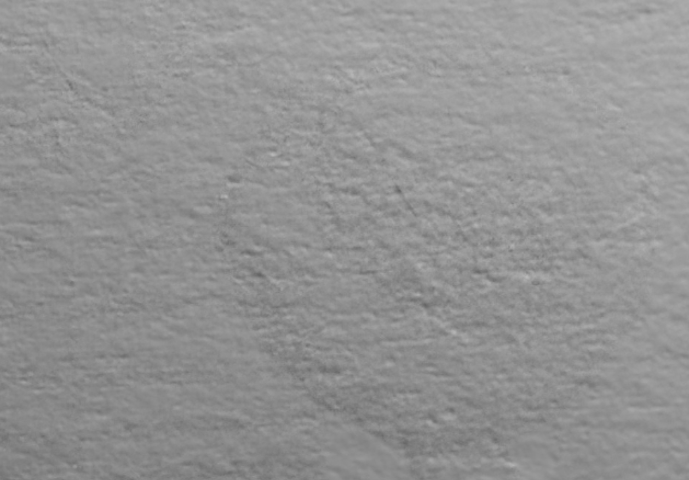
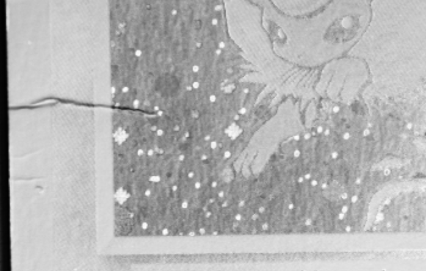

# What are all these modes?

1. **Light Mode**: In this mode, you can interactively change the direction of the light source on the object. It's like virtually moving a flashlight around the object and watching how the light and shadows change. This mode can help you see details that might only be visible from certain angles or under certain lighting conditions.

2. **Normals Mode**: This mode shows a "normal map" of the object, a colorful image that represents the different angles of the surface of the object. By looking at the colors, you can get a sense of the object's texture and any raised or indented features. This mode can help you see if a feature is printed on the object or if it's actually indented into the object's surface.

3. **Diffuse Mode**: This mode removes the color (or albedo) of the object and focuses on its geometry or shape. In this mode, all the colors and patterns are "whitened out", leaving a white version of the object where you can see all the bumps, dips, and textures of the surface, but none of the colors or patterns. This mode is useful for seeing physical imperfections or features on the object's surface that might be hard to see when the object's colors and patterns are in the way.

4. **Specular Enhancement Mode**: This mode enhances or highlights the shiny, reflective parts of the object. It increases the visibility of specular (mirror-like) reflections of light from the surface. This mode can help you see certain details that might be more visible when the light hits the object in a specific way, and can also help you assess the quality of the object's finish.

